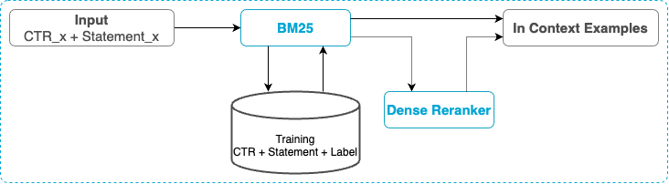

# SemEval NLI4CT

SemEval 2024 Task 2: Safe Biomedical Natural Language Inference for Clinical Trials

## Resources

- [Competition CodaLab Page](https://codalab.lisn.upsaclay.fr/competitions/16190?secret_key=4863f655-9dd6-43f0-b710-f17cb67af607)
- [Dataset paper](https://arxiv.org/abs/2305.03598)
- [Task Github Repo](https://github.com/ai-systems/Task-2-SemEval-2024/tree/main)

## TL;DR

Clinical trials are conducted to assess the effectiveness and safety of new treatments.
Clinical Trial Reports (CTR), outline the methodology and findings of a clinical trial, and they are used to design and prescribe experimental treatments.
The application of LLMs in critical domains, such as real-world clinical trials, requires further investigations accompanied by the development of novel evaluation methodologies grounded in a more systematic behavioural and causal analyses.

This second iteration is intended to ground NLI4CT in interventional and causal analyses of NLI models (YU et al., 2022), enriching the original NLI4CT dataset with a novel contrast set, developed through the application of a set of interventions on the statements in the NLI4CT test set.

## Solution workflow and Research Questions


Our proposed pipeline is an LLM-based solution which leverages In-Context examples.

### RQ 1: Can LLM perform well in zero-shot setting?

### RQ 1.1: Which LLM perform the best in zero-shot setting?

#### Challenges to solve:

- How to force the model to output a minimal response to the query? The model tends to give very long answers
  - Explore system message
- Non-instruction tuned models **cannot generate a coherent response**.
  - For the moment (December 4th, 2023), we are going to focus on LLaMA2-7b-chat, LLaMA2-13b-chat, and Mistral-7b-Instruct.
- GPT-4 is not open access, we require budget which may not arrive on time for this experiment.
  - We also decided to ignore GPT-4

#### Running the Experiments

```bash
python scripts/train.py experiment=zero_shot/llama2_7b_chat
python scripts/train.py experiment=zero_shot/llama2_13b_chat
python scripts/train.py experiment=zero_shot/mistral_7b_instruct
```

#### Results

| Model               | Context Length | Train Accuracy | Train F1 | Train Precision | Train Recall | Valid Accuracy | Valid F1 | Valid Precision | Valid Recall |
| ------------------- | -------------- | -------------- | -------- | --------------- | ------------ | -------------- | -------- | --------------- | ------------ |
| LLaMA2-7b-chat      | 4k             | 0.49           | 0.4759   | 0.4851          | 0.3259       | 0.5            | 0.4927   | 0.5             | 0.38         |
| LLaMA2-13b-chat     | 4k             | 0.4071         | 0.2949   | 0.0407          | 0.008235     | 0.38           | 0.2754   | 0               | 0            |
| Mistral-7b-Instruct | 4k             | 0.50176        | 0.48858  | 0.50134         | 0.66235      | 0.525          | 0.49467  | 0.51678         | 0.77         |
<!-- | ~~GPT-4~~           | 8k             |                |          |                 |              |                |          |                 |              | -->
<!-- | ~~LLaMA2-7b~~       | 4k             |                |          |                 |              |                |          |                 |              | -->
<!-- | ~~LLaMA2-13b~~      | 4k             |                |          |                 |              |                |          |                 |              | -->
<!-- | ~~Mistral-7b~~      | 4k             |                |          |                 |              |                |          |                 |              | -->
<!-- | ~~MistralLite-7b~~  | 16k            |                |          |                 |              |                |          |                 |              | -->
<!-- | ~~Meditron-7b~~     | 2k             |                |          |                 |              |                |          |                 |              | -->

:warning: _Note: "Train\_\*" performance indicates the performance on the training split, but still in a zero-shot setup_ :warning:

#### Finding

- Zero-shot performance of all three experimented models are not very good.
  - It may be attributed to the outputs that are not properly structured
  - Some of them are also just plainly incorrect.
- Assuming Meditron does not perform well in zero-shot manner, we cannot use it in later stages (In-Context Learning) due to its limited context length.
LLMs may ignore the supplied evidence altogether, and investigation is necessary to understand whether the LLMs predict the same albeit the supplied CTR is different.

<!-- ### RQ 1.2: Which instruction template works best?

Zero shot performance of the model seems to be less competitive compared to [the runner up of last year's challenge (Flan-T5)](https://aclanthology.org/2023.semeval-1.137/).
We hypothesised that this may have been caused by the instruction template.
In RQ 1.1, we used the following sub-optimal template:

```text
Evidence: primary trial: <primary_evidence_text> | secondary trial: <secondary_evidence_text>
Statement: <statement_text>
Answer:
```

To evaluate this, we experimented with 11 different instruction templates:

<details>
  <summary>Instruction Templates</summary>
  <ol>
    <li>{evidence} Based on the paragraph above can we conclude that {statement}?\nOPTIONS:\n- Contradiction\n- Entailment\nAnswer: </li>
    <li>{evidence} Based on that paragraph can we conclude that this sentence is true? {statement}\nOPTIONS:\n- Contradiction\n- Entailment\nAnswer: </li>
    <li>{evidence} Can we draw the following conclusion? {statement}\nOPTIONS:\n- Contradiction\n- Entailment\nAnswer: </li>
    <li>{evidence} Does this next sentence follow, given the preceding text? {statement}\nOPTIONS:\n- Contradiction\n- Entailment\nAnswer: </li>
    <li>{evidence} Can we infer the following? {statement}\nOPTIONS:\n- Contradiction\n- Entailment\nAnswer: </li>
    <li>Read the following paragraph and determine if the hypothesis is true: {evidence} Hypothesis: {statement}\nOPTIONS:\n- Contradiction\n- Entailment\nAnswer: </li>
    <li>Read the text and determine if the sentence is true: {evidence} Sentence: {statement}\nOPTIONS:\n- Contradiction\n- Entailment\nAnswer: </li>
    <li>Can we draw the following hypothesis from the context? Context: {evidence} Hypothesis: {statement}\nOPTIONS:\n- Contradiction\n- Entailment\nAnswer: </li>
    <li>Determine if the sentence is true based on the text below: {statement} {evidence}\nOPTIONS:\n- Contradiction\n- Entailment\nAnswer: </li>
    <li>{evidence} Question: Does this imply that {statement}?\nOPTIONS:\n- Contradiction\n- Entailment\nAnswer: </li>
    <li>Evidence: {evidence}\nStatement: {statement}\nQuestion: Is the statement a contradiction or an entailment?\nOPTIONS:\n- Contradiction\n- Entailment\nAnswer: </li>
  </ol>
</details>

#### Results

Using the same LLM (LLaMA2-7b-chat):

| Instruction | Train Accuracy | Train F1 | Train Precision | Train Recall | Valid Accuracy | Valid F1 | Valid Precision | Valid Recall |
| ----------- | -------------- | -------- | --------------- | ------------ | -------------- | -------- | --------------- | ------------ |
| 1           |                |          |                 |              |                |          |                 |              |
| 2           |                |          |                 |              |                |          |                 |              |
| 3           |                |          |                 |              |                |          |                 |              |
| 4           |                |          |                 |              |                |          |                 |              |
| 5           |                |          |                 |              |                |          |                 |              |
| 6           |                |          |                 |              |                |          |                 |              |
| 7           |                |          |                 |              |                |          |                 |              |
| 8           |                |          |                 |              |                |          |                 |              |
| 9           |                |          |                 |              |                |          |                 |              |
| 10          |                |          |                 |              |                |          |                 |              |
| 11          |                |          |                 |              |                |          |                 |              | -->

### RQ 2: Can LLMs augmented with in-context examples perform better than zero-shot LLMs?

#### RQ 2.1: How to choose the best in-context examples?

In order to achieve the best performance, the pipeline must choose the best in-context examples for specific scenarii.
There are some conditions/heuristics that we can leverage to narrow the search space:

- Clinical trial report sections
- Document length

After the filtering, the retriever should select the best examples.
However, there are several hurdles to consider, such as limited sequence length.
We will experiment with several setup:

- Zero-shot: No in-context examples
- BM25: Naively take top-k examples.
- BM25 + length penalty: Penalise document length with respect to the input length (if the input is long, longer documents should be penalised. If the input is short, longer documents get penalised less). Take top-k examples from the adjusted score, and naively include it as examples to the model.

The length penalty in BM25 + length penalty can be defined as:

$$
penalty(x, D_i) = \frac{\alpha (avg(|D|)) + avg(|S|) - |x|}{D_i} - 1
$$

where $\alpha$ denotes the number of documents that the pipeline ideally should retrieve, $x$ denotes the statement. In the iterative BM25, we may want to consider the previously retrieved document, such that $x$ denotes the concatenation of retrieved document(s) and the statement. (Discussion: Each model has a different context length limitation. Should this be reflected?)

To run the experiments efficiently, we retrieved the relevant documents per statement first.
These documents are a concatenation of the CTR evidence and the statement.
We first filter the documents whose Section and Type are the same as the query statement.
Then, we score them using the retriever to get the most relevant documents.
We separated contradiction and entailment examples to help decide the number of examples per label during the In-Context Learning phase.

:warning: At the moment, it's only BM25 :warning:

#### Running the Experiments

```bash
# Install NLTK
pip install nltk
python -m nltk.downloader punkt
python -m nltk.downloader stopwords

# retrieve in context examples with BM25, BM25 + length penalty, BM25 + Dense rerankers
python scripts/retrieve_in_context_examples.py dataloader=retriever retriever=bm25
python scripts/retrieve_in_context_examples.py dataloader=retriever retriever=bm25_length_penalty
python scripts/retrieve_in_context_examples.py dataloader=retriever retriever=bm25_contriever_reranker
python scripts/retrieve_in_context_examples.py dataloader=retriever retriever=bm25_biolinkbert_reranker
python scripts/retrieve_in_context_examples.py dataloader=retriever retriever=bm25_pubmedbert_reranker

# run in context predictions
## One shot
python scripts/train.py experiment=one_shot/mistral_7b_instruct retriever=bm25
python scripts/train.py experiment=one_shot/mistral_7b_instruct retriever=bm25_length_penalty
python scripts/train.py experiment=one_shot/mistral_7b_instruct retriever=bm25_contriever_reranker
python scripts/train.py experiment=one_shot/mistral_7b_instruct retriever=bm25_biolinkbert_reranker

## Two shot
python scripts/train.py experiment=two_shot/mistral_7b_instruct retriever=bm25
python scripts/train.py experiment=two_shot/mistral_7b_instruct retriever=bm25_length_penalty
python scripts/train.py experiment=two_shot/mistral_7b_instruct retriever=bm25_contriever_reranker
python scripts/train.py experiment=two_shot/mistral_7b_instruct retriever=bm25_biolinkbert_reranker
```

#### Results

| Model                           | Train Accuracy | Train F1 | Train Precision | Train Recall | Valid Accuracy | Valid F1 | Valid Precision | Valid Recall |
| ------------------------------- | -------------- | -------- | --------------- | ------------ | -------------- | -------- | --------------- | ------------ |
| Zero-shot                       | 0.50176        | 0.48858  | 0.50134         | 0.66235      | 0.525          | 0.49467  | 0.51678         | 0.77         |
| BM25                            |                |          |                 |              |                |          |                 |              |
| BM25 + length penalty           |                |          |                 |              |                |          |                 |              |

#### RQ 2.2: Is domain-adapted dense reranker necessary?



We noticed several statements which require a degree of biomedical knowledge to understand concept synonyms.
Sparse retrievers may not work well for these instances.
Hence, experiments with dense retriever is necessary.

However, the available dense retrievers tend to have a very small context length (i.e. 512).
Thus, we experimented with dense retrievers that will only rerank based on the statements. 

| Model               | Train Accuracy | Train F1 | Train Precision | Train Recall | Valid Accuracy | Valid F1 | Valid Precision | Valid Recall |
| ------------------- | -------------- | -------- | --------------- | ------------ | -------------- | -------- | --------------- | ------------ |
| Zero-shot           | 0.50176        | 0.48858  | 0.50134         | 0.66235      | 0.525          | 0.49467  | 0.51678         | 0.77         |
| BM25                |                |          |                 |              |                |          |                 |              |
| BM25 + Contriever (Dense, General)  |                |          |                 |              |                |          |                 |              |
| BM25 + BioLinkBERT (Dense, Biomedical) |                |          |                 |              |                |          |                 |              |

#### RQ 2.4: Will interleaving Chain-of-Thought and retrieval help?

[paper](https://arxiv.org/abs/2212.10509)


### RQ 3: Is parameter fine-tuning necessary?

Note: Base model is the best-performing LLM from the previous sub-RQ.

(Format: Template1/Template2/Tempalte3, Model = Mistral-7B-Instruct-v0.1)

| Model     | Train Accuracy | Train F1 | Train Precision | Train Recall | Valid Accuracy | Valid F1 | Valid Precision | Valid Recall |
| --------- | -------------- | -------- | --------------- | ------------ | -------------- | -------- | --------------- | ------------ |
| Zero-shot | 0.4900/0.4929/0.4965 | 0.4899/0.4869/0.4301 | 0.4902/0.4910/0.4889 | 0.5024/0.3847/0.1553 | 0.4850/0.4450/0.4850 | 0.4828/0.4331/0.4461 | 0.4699/0.4927/0.5203 | 0.6153/0.5988/0.4835 |
| 1-shot    | 0.7141/0.4494/0.4635 | 0.7135/0.4468/0.4448 | 0.6957/0.4555/0.4424 | 0.7612/0.5176/0.2800 | 0.5600/0.5200/0.5400 | 0.5589/0.5176/0.5383 | 0.5545/0.5175/0.5455 | 0.6100/0.5900/0.4800 |
| 2-shot    | 0.4606/0.4912/0.5188 | 0.4474/0.4852/0.5182 | 0.4699/0.4927/0.5203 | 0.6153/0.5988/0.4835 | 0.5300/0.5350/0.5300 | 0.4868/0.5298/0.5277 | 0.5190/0.5289/0.5263 | 0.8200/0.6400/0.6000 |
| LoRA      |                |          |                 |              |                |          |                 |              |

### RQ 4: Can LLMs predict in a faithful and consistent manner?

#### RQ 4.1: Can LLMs predict consistently should the input data is lexically altered?

To evaluate the consistency of the LLMs' predictions, we can try to alter the input data while keeping its meaning.
We created a contrastive corpus to evaluate this.
This contrastive corpus is created by replacing entities within the statements with their synonyms.
We utilised `scispacy` pipeline, specifically:

- NER model (`en_ner_bc5cdr_md`) to extract `CHEMICAL` and `DISEASE` entities
- Abbreviation Detector
- Entity linker (UMLS)

We also implemented a naive postprocessing to remove synonyms that contain: `,`, `(`, and `)` which are unlikely to appear in real statements. For instance:

> Original entity: `capecitabine` \
> CUI: `C0671970` \
> Aliases:
>
> - Capecitabinum :white_check_mark:
> - Capecitabine-containing product :white_check_mark:
> - Capécitabine :white_check_mark:
> - Capecitabine :white_check_mark:
> - CAPE :white_check_mark:
> - Capecitabin :white_check_mark:
> - Capecitabine (substance) :x:
> - 5'-Deoxy-5-fluoro-N-[(pentyloxy)carbonyl]-cytidine :x:
> - pentyl 1-(5-deoxy-β-D-ribofuranosyl)-5-fluoro-1,2-dihydro-2-oxo-4-pyrimidinecarbamate :x:
> - N(4)-pentyloxycarbonyl-5'-deoxy-5-fluorocytidine :x:

To create the corpus:

```bash
# Create contrastive corpus from the training statements
python scripts/create_contrastive_corpus.py --data_path data/train.json
# Create contrastive corpus from the validation statements
python scripts/create_contrastive_corpus.py --data_path data/dev.json
```

One potential solution to address this consistency is by fine-tuning the model in a contrastive learning framework, forcing the model to encode semantically equivalent statements similarly.

| Model                   | Train Accuracy | Train F1 | Train Precision | Train Recall | Valid Accuracy | Valid F1 | Valid Precision | Valid Recall |
| ----------------------- | -------------- | -------- | --------------- | ------------ | -------------- | -------- | --------------- | ------------ |
| Zero-shot               |                |          |                 |              |                |          |                 |              |
| Retrieval-augmented ICL |                |          |                 |              |                |          |                 |              |
| LoRA                    |                |          |                 |              |                |          |                 |              |
| Contrastive fine-tuning |                |          |                 |              |                |          |                 |              |

## Task Description

## Research Aims

- "To investigate the consistency of NLI models in their representation of semantic phenomena necessary for complex inference in clinical NLI settings"
- "To investigate the ability of clinical NLI models to perform faithful reasoning, i.e., make correct predictions for the correct reasons."

## Textual Entailment

CTRs can be categorised into 4 sections:

- Eligibility criteria - A set of conditions for patients to be allowed to take part in the clinical trial
- Intervention - Information concerning the type, dosage, frequency, and duration of treatments being studied.
- Results - Number of participants in the trial, outcome measures, units, and the results.
- Adverse events - These are signs and symptoms observed in patients during the clinical trial.

## Intervention targets

- Numerical - LLMs still struggle to consistently apply numerical and quantitative reasoning. As NLI4CT requires this type of inference, we will specifically target the models' numerical and quantitative reasoning abilities.
- Vocabulary and syntax - Acronyms and aliases are significantly more prevalent in clinical texts than general domain texts, and disrupt the performance of clinical NLI models. Additionally, models may experience shortcut learning, relying on syntactic patterns for inference. We target these concepts and patterns with an intervention.
- Semantics - LLMs struggle with complex reasoning tasks when applied to longer premise-hypothesis pairs. We also intervene on the statements to exploit this.
- Notes - The specific type of intervention performed on a statement will not be available at test or training time.

## EDA

### Sequence Length

- With naive concatenation of primary evidence (+ secondary evidence) + statement:
  - Training

    

  - Validation

    

## How to run

Setup the environment:

```
conda env create -f environment.yml
conda activate clinical_peft
```

Run experiments:

```bash
python scripts/train.py experiment=llama2_7b_zeroshot
```
