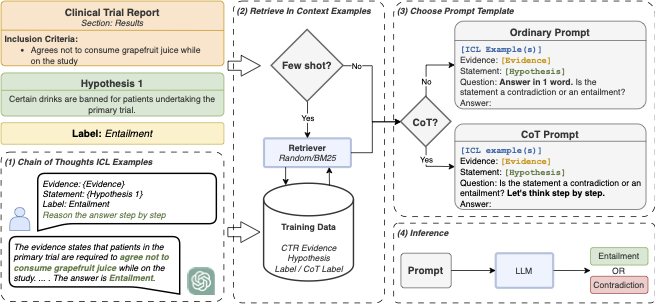
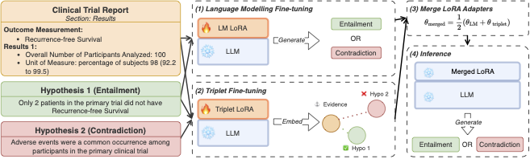

# Edinburgh Clinical NLP at SemEval-2024 Task 2: Fine-tune your model unless you have access to GPT-4

## Resources

- [🚀 Preprint](https://arxiv.org/abs/2404.00484)
- [Competition CodaLab Page](https://codalab.lisn.upsaclay.fr/competitions/16190?secret_key=4863f655-9dd6-43f0-b710-f17cb67af607)
- [Dataset paper](https://arxiv.org/abs/2305.03598)
- [Task Github Repo](https://github.com/ai-systems/Task-2-SemEval-2024/tree/main)
- Our pretrained adapters (refer to the paper, these adapters would perform best when merged):
    - [LM adapter](https://huggingface.co/aryopg/MistralLite-7b_lora_common_semeval_nli4ct_2024)
    - [Triplet adapter](https://huggingface.co/aryopg/MistralLite-7b_lora_contrastive_semeval_nli4ct_2024)

## TL;DR

Clinical trials are conducted to assess the effectiveness and safety of new treatments.
Clinical Trial Reports (CTR), outline the methodology and findings of a clinical trial, and they are used to design and prescribe experimental treatments.
The application of LLMs in critical domains, such as real-world clinical trials, requires further investigations accompanied by the development of novel evaluation methodologies grounded in a more systematic behavioural and causal analyses.

This second iteration is intended to ground NLI4CT in interventional and causal analyses of NLI models, enriching the original NLI4CT dataset with a novel contrast set, developed through the application of a set of interventions on the statements in the NLI4CT test set.

## Solution workflow

### Without fine-tuning



### With fine-tuning


## Experiment codes

### Environment setup

```bash
conda env create -f environment.yml
conda activate semeval_nli4ct
```

### RQ 1: Can zero-shot LLMs perform well?

```bash
python scripts/train.py experiment=0_shot/llama2_7b_chat
python scripts/train.py experiment=0_shot/llama2_13b_chat
python scripts/train.py experiment=0_shot/mistral_7b_instruct
python scripts/train.py experiment=0_shot/mistrallite_7b
```

To run the GPT-4 experiment, use the [`scripts/notebooks/gpt4_inference.ipynb`](scripts/notebooks/gpt4_inference.ipynb). You have to add your own `OPENAI_API_KEY` as an environment variable.

### RQ 2: Can smaller LLMs perform on par with GPT-4 with prompting strategies?

#### In-Context Learning

```bash
# 1-shot CoT experiments
python scripts/train.py experiment=1_shot/mistral_7b_instruct retriever=bm25
python scripts/train.py experiment=1_shot/llama2_7b_chat retriever=bm25
python scripts/train.py experiment=1_shot/llama2_13b_chat retriever=bm25
python scripts/train.py experiment=1_shot/mistrallite_7b retriever=bm25

# 2-shot CoT experiments
python scripts/train.py experiment=2_shot/mistral_7b_instruct retriever=bm25
python scripts/train.py experiment=2_shot/llama2_7b_chat retriever=bm25
python scripts/train.py experiment=2_shot/llama2_13b_chat retriever=bm25
python scripts/train.py experiment=2_shot/mistrallite_7b retriever=bm25
```

#### Chain-of-Thoughts

```bash
python scripts/train.py experiment=cot_0_shot/mistral_7b_instruct
python scripts/train.py experiment=cot_0_shot/llama2_7b_chat
python scripts/train.py experiment=cot_0_shot/llama2_13b_chat
python scripts/train.py experiment=cot_0_shot/mistrallite_7b
```

#### In-Context Learning + Chain-of-Thoughts

```bash
# Create the ChatGPT explanation
# Replace AZURE_OPENAI_KEY and AZURE_OPENAI_ENDPOINT accordingly
python scripts/generate_cot_chatgpt.py

# 1-shot CoT experiments
python scripts/train.py experiment=cot_1_shot/mistral_7b_instruct retriever=bm25
python scripts/train.py experiment=cot_1_shot/llama2_7b_chat retriever=bm25
python scripts/train.py experiment=cot_1_shot/llama2_13b_chat retriever=bm25
python scripts/train.py experiment=cot_1_shot/mistrallite_7b retriever=bm25

# 2-shot CoT experiments
python scripts/train.py experiment=cot_2_shot/mistral_7b_instruct retriever=bm25
python scripts/train.py experiment=cot_2_shot/llama2_7b_chat retriever=bm25
python scripts/train.py experiment=cot_2_shot/llama2_13b_chat retriever=bm25
python scripts/train.py experiment=cot_2_shot/mistrallite_7b retriever=bm25
```


### RQ 3: Can fine-tuned smaller LLMs perform on par with GPT-4?

#### Can LoRA fine-tuning improve the performance of LLMs?
```bash
python scripts/train.py experiment=fine_tune/llama2_7b_chat
python scripts/train.py experiment=fine_tune/llama2_13b_chat
python scripts/train.py experiment=fine_tune/meditron_7b
python scripts/train.py experiment=fine_tune/mistral_7b_instruct
python scripts/train.py experiment=fine_tune/mistrallite_7b
```

#### Can merging LoRA adapters improve the performance of LLMs?

```bash
# Train the triplet loss adapter separately
python scripts/fine_tune_contrastive_learning.py experiment=fine_tune/mistrallite_7b

python scripts/train.py experiment=pretrained_0_shot/mistrallite_7b_contrastive_common_avg
```

To run the `pretrained_0_shot/mistrallite_7b_contrastive_common_avg` experiment, you can download our pretrained LoRA adapters:

- [LM adapter](https://huggingface.co/aryopg/MistralLite-7b_lora_common_semeval_nli4ct_2024)
- [Triplet adapter](https://huggingface.co/aryopg/MistralLite-7b_lora_contrastive_semeval_nli4ct_2024)
